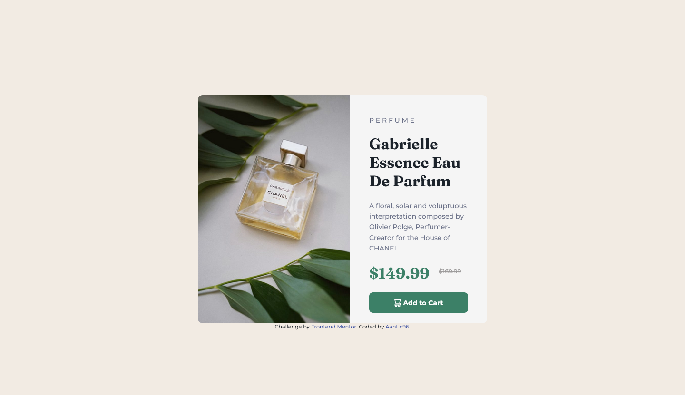

# Frontend Mentor - Product preview card component solution

This is a solution to the [Product preview card component challenge on Frontend Mentor](https://www.frontendmentor.io/challenges/product-preview-card-component-GO7UmttRfa). Frontend Mentor challenges help you improve your coding skills by building realistic projects. 

## Table of contents

- [Overview](#overview)
  - [The challenge](#the-challenge)
  - [Screenshot](#screenshot)
  - [Links](#links)
- [My process](#my-process)
  - [Built with](#built-with)
  - [What I learned](#what-i-learned)
  - [Continued development](#continued-development)
  - [Useful resources](#useful-resources)
- [Author] (#Author)
- [Acknowledgments](#acknowledgments)

## Overview

This exercise improves student's CSS and HTML knowledge.

### The challenge

Users should be able to:

- View the optimal layout depending on their device's screen size
- See hover and focus states for interactive elements

### Screenshot




### Links

- Solution URL: [Github Repo](https://github.com/Aantic96/Aantic96.github.io/tree/main/FrontendMentor_Projects/Project_1)
- Live Site URL: [Github Page](https://aantic96.github.io/FrontendMentor_Projects/Project_1/index.html)

## My process

I first made the desktop version and afterwards I've added the mobile one. In the end I spent time polishing them both.

### Built with

- Semantic HTML5 markup
- CSS custom properties
- Flexbox
- CSS Grid

### What I learned

```css
.my-cont {
    display: grid;
    position: relative;
    grid-template-columns: auto auto;
    grid-template-rows: auto auto;
    width: 38rem;
    margin-left: auto;
    margin-right: auto;
    margin-top: 200px
}
```

If you want more help with writing markdown, we'd recommend checking out [The Markdown Guide](https://www.markdownguide.org/) to learn more.

I learned size value "rem" and also how to make my own container that includes grid.
### Continued development

I want to master usage of grid and flexbox - I still don't feel completely comfortable using them.

### Useful resources

- [W3Schools](https://www.w3schools.com/css/default.asp) - This helped me to navigate my way through CSS and to acquire some basic knowledge.
- [Stackoverflow](https://stackoverflow.com/) - This is an amazing page that pretty much has solution for every question I've had.

## Author

- Frontend Mentor - [@Aantic96](https://www.frontendmentor.io/profile/Aantic96)