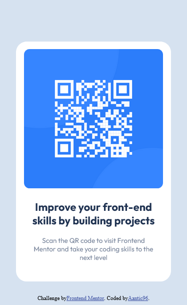

# Frontend Mentor - QR code component solution

This is a solution to the [QR code component challenge on Frontend Mentor](https://www.frontendmentor.io/challenges/qr-code-component-iux_sIO_H). Frontend Mentor challenges help you improve your coding skills by building realistic projects. 

## Table of contents

- [Overview](#overview)
  - [Screenshot](#screenshot)
  - [Links](#links)
- [My process](#my-process)
  - [Built with](#built-with)
  - [What I learned](#what-i-learned)
  - [Continued development](#continued-development)
  - [Useful resources](#useful-resources)
- [Author](#author)
- [Acknowledgments](#acknowledgments)

## Overview

This is my 2nd project on Frontend mentor. It is even easier than the first one, but it was still a fun one to build.

### Screenshot

### Links

- Solution URL: [Add solution URL here](https://your-solution-url.com)
- Live Site URL: [Add live site URL here](https://your-live-site-url.com)

## My process

I first made the container, then I followed everything in style-guide. Once done with the basic stuff in both HTML and CSS i focused on the image and the text.

### Built with

- Semantic HTML5 markup
- CSS custom properties
- Flexbox
- CSS Grid

### What I learned

Image resizing, positioning and scaling elements properly.

### Continued development

Upon getting some useful advice on the page, I followed the best practices and made this project. Despite it being easier than the last one, I feel more confident in my HTML & CSS skills.

### Useful resources

- [Relative Untits](https://www.joshwcomeau.com/css/surprising-truth-about-pixels-and-accessibility/) - This helped me understand relative units.
- [W3schools](https://www.w3schools.com/css/css3_images.asp) - This is an amazing webpage in general.

## Author

- Frontend Mentor - [@Aantic96](https://www.frontendmentor.io/profile/Aantic96)
